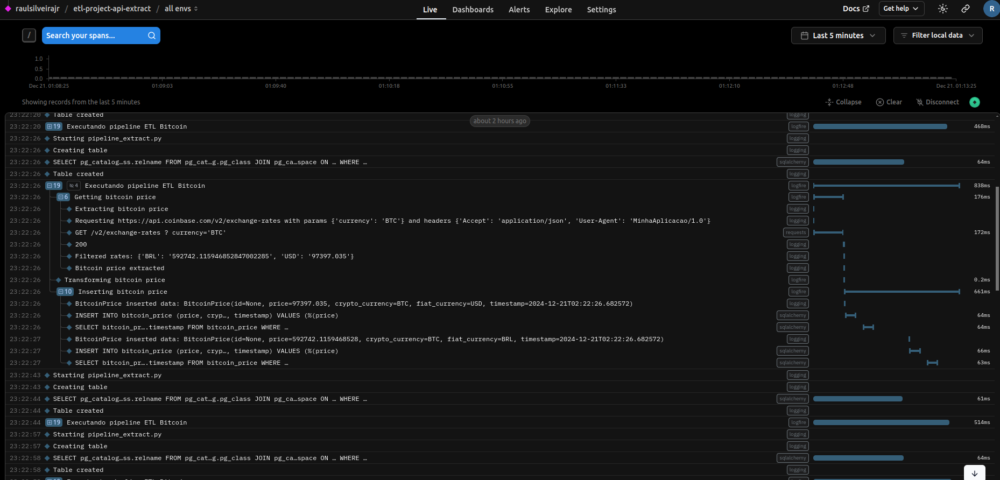

# ETL Project - API Data Extraction
### Based on https://www.youtube.com/live/xvCwZ73muV8

## Overview
This project implements an ETL (Extract, Transform, Load) pipeline that extracts data from Coinbase API and loads it into a target database.

## Features
- API data extraction with error handling
- Data transformation and cleaning
- Data loading to a target database
- Logging and monitoring capabilities

## Prerequisites
- Python 3.11+
- pip (Python package installer)
- poetry (Python package manager)

## Installation
1. Clone the repository:
```bash
git clone https://github.com/raulsilveirajr/ETLProjectAPIExtract
cd ETLProjectAPIExtract
```

2. Create and activate a virtual environment (optional but recommended):
```bash
python -m venv .venv
source .venv/bin/activate  # On Windows: venv\Scripts\activate
```

3. Install the project dependencies:
```bash
poetry install
```

## Examples
The project includes examples of implementation in the `examples/` folder. To run each example, use the following commands:

### Example 01
```bash
python3 examples/example_01.py
```

### Example 02
```bash
python3 examples/example_02.py
```

### Example 03
```bash
python3 examples/example_03.py
```
  
### Exemplo 04
```bash
python3 exemplos/exemplo_04.py
```

# Resources

## Running on render.com 
https://dashboard.render.com/web/srv-ctittul2ng1s73bf9g30


## Dashboard Logfire
https://logfire.pydantic.dev/raulsilveirajr/etl-project-api-extract/dashboards/6cc25f8c-c7c8-4b73-989e-21d0327ef6db



# Dependencies
- requests
- python-dotenv
- tinydb
- sqlalchemy
- psycopg2
- psycopg2-binary
- logfire (extras = ["requests", "sqlalchemy"], version = "^2.9.0")
- streamlit
- pandas
